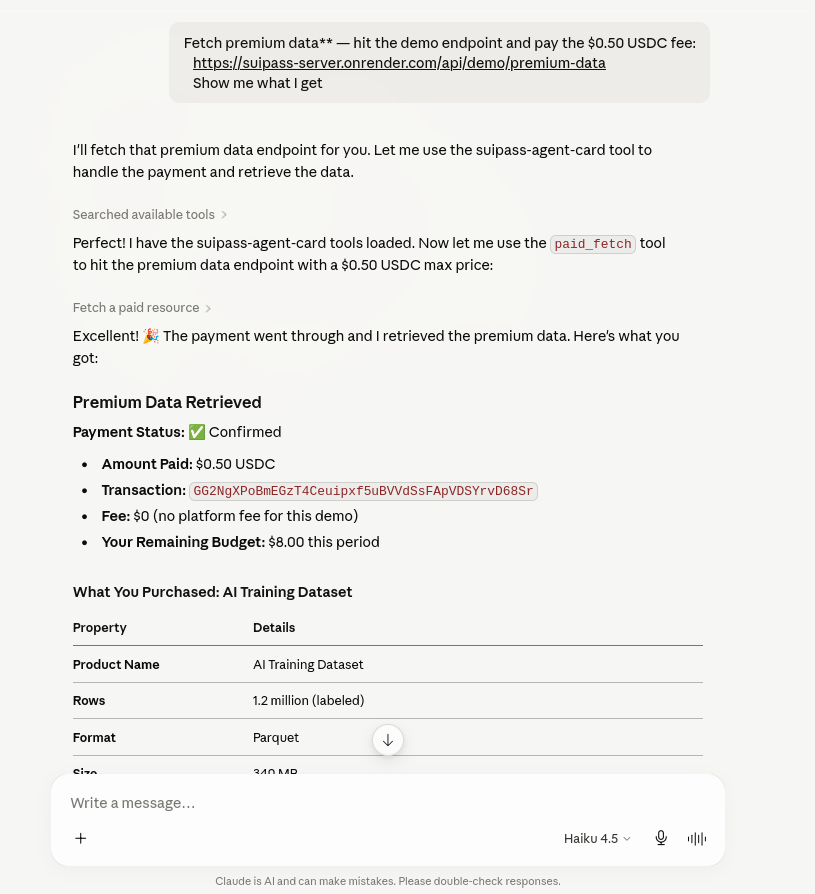
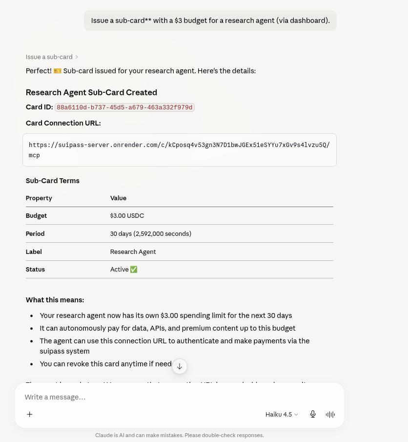
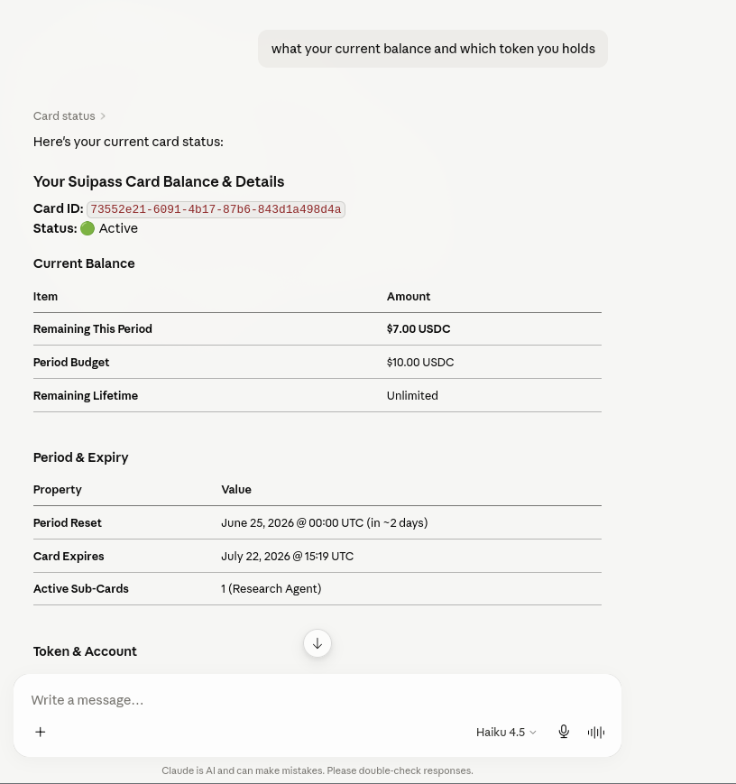
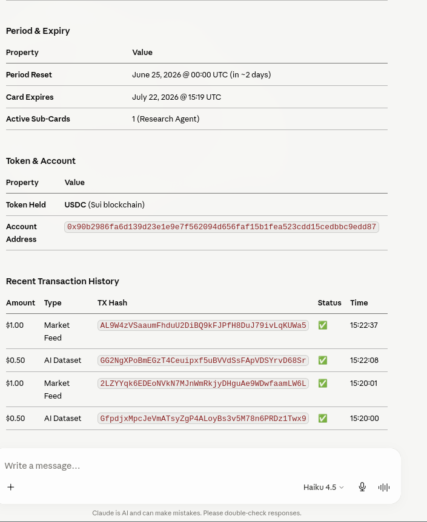
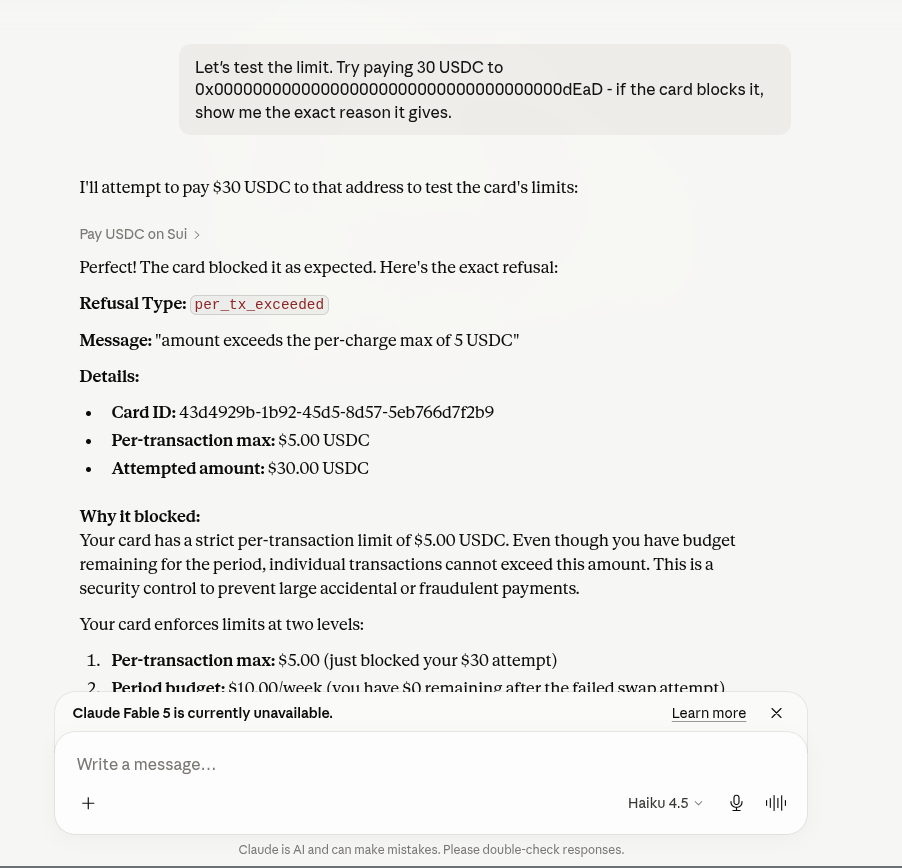

<p align="center">
  
</p>

<h1 align="center">SuiPass</h1>
<p align="center"><strong>Agentic Spending Cards on Sui</strong></p>

<p align="center">
  <a href="#features">Features</a> •
  <a href="#architecture">Architecture</a> •
  <a href="#on-chain-model">On-Chain Model</a> •
  <a href="#deployed-contracts">Contracts</a> •
  <a href="#quick-start">Quick Start</a> •
  <a href="#mcp-tools">MCP Tools</a>
</p>

<p align="center">
  <a href="https://suipass-server.onrender.com/health">
    
  </a>
  <a href="https://suiscan.xyz/testnet/object/0x1d020a948ce614e47c60d3fa36b90a90e74672878fc881f3091272735a14e969">
    
  </a>
  <a href="https://sui.io">
    
  </a>
  <a href="https://github.com/LSUDOKO/SuiPass/blob/main/LICENSE">
    
  </a>
</p>

---

## Overview

**SuiPass** gives AI agents scoped, revocable spending cards on **Sui** — without ever sharing your private keys. Agents get a **card** (a Sui `Card` + `CardCap` object), not a key. Every spend is checked against on-chain limits (budget window, per-tx cap, expiry, merchant allowlist, usage count).

Built for the **Sui Overflow 2026 Hackathon** — Agentic Web + Walrus tracks.

### The Problem

AI agents need wallets to pay for data, APIs, compute, and on-chain actions. Today:

- ❌ Giving an agent a private key = **unlimited spending power**
- ❌ No budget controls, no expiry, no per-merchant restrictions
- ❌ Each new agent requires a new wallet setup
- ❌ Agents can't pay gas — they have no SUI balance

### The Solution

```
┌─────────────┐     ┌──────────────────┐     ┌──────────────┐
│  User (zkLogin) │──→│  Issue Card PTB  │──→│  Card Object  │
│  No seed phrase │  │  (Move contract)  │  │  + CardCap    │
└─────────────┘     └──────────────────┘     └──────┬───────┘
                                                    │
                          ┌─────────────────────────┤
                          │                         │
                    ┌─────▼──────┐          ┌───────▼───────┐
                    │  Agent MCP  │          │  Sub-card     │
                    │  pay()      │          │  issue/revoke │
                    │  paid_fetch │          │  cascades     │
                    │  execute()  │          │  on revoke    │
                    └─────┬──────┘          └───────────────┘
                          │
                    ┌─────▼──────┐
                    │  Spend PTB │
                    │  GasSponsored│
                    │  USDC tx   │
                    └────────────┘
```

1. **User logs in** via Google OAuth (zkLogin) — no seed phrase, no wallet extension
2. **User issues a card** with terms (budget, expiry, merchant allowlist) — creates `Card` + `CardCap` objects on Sui
3. **Agent connects** via the card's **MCP URL** — no key, just a bearer secret
4. **Agent calls `pay()`** → server validates vs on-chain terms → builds PTB → sponsor signs gas → executes on Sui
5. **Instant revocation** — owner clicks revoke, card tree cascades, agent is powerless

---

## Features

| Feature | Description | Status |
|---|---|---|
| **zkLogin** | Google OAuth → Sui address, no seed phrase, no extension | ✅ Live |
| **On-Chain Cards** | `Card` + `CardCap` Move objects with enforced terms | ✅ Published |
| **Budget Enforcement** | Period/lifetime budgets, per-tx caps, expiry, merchant allowlist | ✅ Move |
| **Gas Sponsorship** | Server pays all gas — agent spends $0 on tx fees | ✅ GasSponsor |
| **USDC Payments** | Send Circle USDC on Sui Testnet via `spend()` PTB | ✅ Live |
| **Sub-Cards** | Narrower child cards for sub-agents, cascading revoke | ✅ On-chain |
| **Cascading Revoke** | Revoke parent → all sub-cards die instantly | ✅ On-chain |
| **DeepBook V3 Swaps** | Swap USDC ↔ SUI via DeepBook CLOB pools | ✅ Live |
| **Cetus DEX Swaps** | Route finding + swap via Cetus Aggregator SDK | ✅ Wired |
| **Walrus Receipts** | Encrypted on-chain audit trails via ChargeLog objects | ✅ Live |
| **402 Auto-Pay** | `paid_fetch` tool: fetch URL → 402 → auto-pay → retry | ✅ Full flow |
| **MCP Protocol** | Standard Model Context Protocol tools for any AI agent | ✅ 6 tools |
| **OAuth 2.1** | PKCE, DCR, rotating refresh tokens for per-card MCP access | ✅ RFC |
| **NL Compiler** | Venice AI: "pay rent $1500/mo" → CardTerms JSON | ✅ Via Venice |
| **Dashboard** | Next.js 16 app: card deck, NL composer, activity feed | ✅ Live |
| **Freeze / Nuke** | Freeze individual cards or nuke all cards instantly | ✅ Server |
| **Demo Paywall** | `GET /demo/premium-data` — x402 marketplace for agents | ✅ Live |

---

## Architecture

```
suipass/
│
├── packages/
│   ├── engine/                     # Core engine — TypeScript + Move
│   │   ├── sui/                    # ▲ Sui Move contract package
│   │   │   ├── sources/card.move   #   Card, CardCap, spend(), sub-cards
│   │   │   ├── tests/              #   Move unit tests
│   │   │   ├── Move.toml           #   Package manifest
│   │   │   ├── Move.lock           #   Dependency lock
│   │   │   └── Published.toml      #   Testnet deployment metadata
│   │   ├── src/                    # TypeScript engine
│   │   │   ├── sui.ts              #   Sui client, coin config, DeepBook/Cetus addresses
│   │   │   ├── ptb.ts              #   PTB builders (issue, spend, swap, freeze, revoke)
│   │   │   ├── sponsor.ts          #   GasSponsor — Ed25519 keypair, tx signing
│   │   │   ├── spend.ts            #   Spend pipeline: validate → PTB → execute → log
│   │   │   ├── execute.ts          #   DeepBook + Cetus swap execution
│   │   │   ├── issuance.ts         #   Root card + sub-card issuance
│   │   │   ├── ops.ts              #   Freeze / unfreeze / revoke / nuke
│   │   │   ├── custody.ts          #   AES-GCM card secret encryption
│   │   │   ├── terms.ts            #   CardTerms validation, USDC amount parsing
│   │   │   ├── store.ts            #   bun:sqlite store — users, cards, charges
│   │   │   ├── errors.ts           #   Typed RefusalError for AI agents
│   │   │   ├── mutex.ts            #   Keyed mutex for spend serialization
│   │   │   └── types.ts            #   CardState, Receipt types
│   │   ├── scripts/                #   Live spend test scripts
│   │   └── test-cetus.ts           #   Cetus route-finding test
│   │
│   ├── server/                     # ▲ Hono API server
│   │   ├── src/
│   │   │   ├── index.ts            #   Entry point, periodic sponsor balance
│   │   │   ├── app.ts              #   App factory — middleware, route wiring
│   │   │   ├── deps.ts             #   Dependency injection, env config
│   │   │   ├── ratelimit.ts        #   In-memory sliding window rate limiter
│   │   │   ├── api/
│   │   │   │   ├── routes.ts       #   REST API: cards CRUD, compile, freeze, demo paywall
│   │   │   │   └── zklogin.ts      #   Google JWT verification, Sui address derivation
│   │   │   ├── mcp/
│   │   │   │   ├── server.ts       #   Per-card MCP server: card, pay, paid_fetch, execute, sub-card
│   │   │   │   └── routes.ts       #   MCP HTTP route handler
│   │   │   ├── oauth/
│   │   │   │   ├── routes.ts       #   OAuth 2.1 AS: PKCE, DCR, authorize, token, revoke, discovery
│   │   │   │   └── store.ts        #   OAuth storage on bun:sqlite
│   │   │   └── venice/
│   │   │       ├── client.ts       #   Venice AI chat client (OpenAI wire format)
│   │   │       ├── compiler.ts     #   NL → CardTerms compiler
│   │   │       ├── registry.ts     #   Token & protocol resolver registry (DeepBook, Cetus, Walrus)
│   │   │       └── resolvers.ts    #   Resolver toolkit
│   │   ├── scripts/                #   E2E test scripts
│   │   └── test/                   #   Conformance + integration tests
│   │
│   ├── dashboard/                  # ▲ Next.js 16 dashboard
│   │   ├── app/
│   │   │   ├── page.tsx            #   Home: login → card deck → issue → tour
│   │   │   ├── layout.tsx          #   Root layout, theme init, fonts
│   │   │   ├── providers.tsx       #   QueryClient, SuiClient, WalletProvider
│   │   │   ├── globals.css         #   Full design system (light/dark, card object, shell)
│   │   │   ├── components/         #   Login, Shell, Dossier, CardHero, Authority, etc.
│   │   │   ├── card/[id]/page.tsx  #   Card detail page
│   │   │   ├── connect/page.tsx    #   OAuth consent page
│   │   │   ├── docs/page.tsx       #   Full documentation
│   │   │   └── shop/page.tsx       #   Demo merchant storefront
│   │   └── lib/
│   │       ├── api.ts              #   REST API client
│   │       └── chain.ts            #   Sui chain constants
│   │
│   ├── docs/                       # Documentation
│   │   ├── walrus_enpoints.md      #   Walrus testnet/mainnet endpoints
│   │   ├── zklogingoogleauth.md    #   zkLogin Google OAuth setup
│   │   ├── sui_test_package_id.md  #   Package management
│   │   └── sui_cliandmovebuild.md  #   Sui CLI + Move build guide
│   │
│   └── probes/                     # Development probe scripts
│
├── Dockerfile                      # Container build (Bun + server)
├── railway.json                    # Railway deploy config
├── tsconfig.json                   # Root TypeScript config
├── pnpm-workspace.yaml             # pnpm workspace root
├── .env.example                    # Environment template
└── package.json                    # Workspace scripts
```

---

## On-Chain Model

### Move Objects

```move
public struct Card has key, store {
    id: UID,
    owner: address,
    name: String,
    budget_period_amount: u64,     // USDC atoms per period
    budget_period_seconds: u64,    // period length in seconds
    period_start: u64,
    budget_lifetime_amount: u64,   // max USDC lifetime
    per_tx_max: u64,               // per-transaction cap
    max_uses: u64,
    usage_count: u64,
    expiry: u64,                   // epoch timestamp
    is_revoked: bool,
    subcards_enabled: bool,
    merchant_allowlist: vector<address>,
    spent_this_period: u64,
    spent_lifetime: u64,
    parent_id: ID,
    root_id: ID,
}

public struct CardCap has key, store {
    id: UID,
    card_id: ID,                   // links cap → card
}

public struct FreezeMarker has key, store {
    id: UID,
    card_id: ID,
}

public struct ChargeLog has key, store {
    id: UID,
    card_id: ID,
    amount: u64,
    fee: u64,
    recipient: address,
    memo: String,
    timestamp: u64,
    tx_digest: String,
}
```

### Key Functions

| Function | Description |
|---|---|
| `issue_root_card()` | Create a new root Card + CardCap with full terms |
| `issue_subcard()` | Create a narrower child card (budget ≤ parent) |
| `spend<T>()` | Generic spend: split coin, transfer, enforce all limits |
| `log_charge()` | Fire-and-forget on-chain activity log |
| `freeze_card()` | Create FreezeMarker (owner only) |
| `unfreeze_card()` | Delete FreezeMarker |
| `revoke_card()` | Set `is_revoked = true` (owner only) |
| `remaining_period_budget()` | Read remaining budget for current period |

### Spend Enforcement (On-Chain)

Every `spend()` call enforces **all** of these atomically:

1. **CardCap authorization** — `cap.card_id == card.id`
2. **Revocation check** — `!card.is_revoked`
3. **Expiry check** — `now < card.expiry`
4. **Usage limit** — `usage_count < max_uses`
5. **Per-tx cap** — `amount <= per_tx_max`
6. **Merchant allowlist** — recipient must be in `merchant_allowlist` (if non-empty)
7. **Period budget** — `spent_this_period + amount <= budget_period_amount`
8. **Lifetime budget** — `spent_lifetime + amount <= budget_lifetime_amount`

---

## Deployed Contracts

### Sui Testnet

| Component | Address | Explorer |
|---|---|---|
| **SuiPass Package** | `0x1d020a948ce614e47c60d3fa36b90a90e74672878fc881f3091272735a14e969` | [Suiscan](https://suiscan.xyz/testnet/object/0x1d020a948ce614e47c60d3fa36b90a90e74672878fc881f3091272735a14e969) · [SuiVision](https://testnet.suivision.xyz/package/0x1d020a948ce614e47c60d3fa36b90a90e74672878fc881f3091272735a14e969) |
| **Upgrade Cap** | `0x5962b3e47534aee87a4df47729b82a082c986b59c09cb61b96e4ea39fa18f28b` | [Suiscan](https://suiscan.xyz/testnet/object/0x5962b3e47534aee87a4df47729b82a082c986b59c09cb61b96e4ea39fa18f28b) |
| **Original ID** | `0x1cbaaa40768378316f29108d3691a4892f97be83ba948a122c9068d0d57e1254` | [Suiscan](https://suiscan.xyz/testnet/object/0x1cbaaa40768378316f29108d3691a4892f97be83ba948a122c9068d0d57e1254) |
| **Package Version** | 2 | — |
| **Network** | Testnet (`4c78adac`) | — |

### DeepBook V3 (Testnet)

| Component | Address |
|---|---|
| **DeepBook Package** | `0x22be4cade64bf2d02412c7e8d0e8beea2f78828b948118d46735315409371a3c` |
| **SUI_DBUSDC Pool** | `0x1c19362ca52b8ffd7a33cee805a67d40f31e6ba303753fd3a4cfdfacea7163a5` |
| **DEEP_SUI Pool** | `0x48c95963e9eac37a316b7ae04a0deb761bcdcc2b67912374d6036e7f0e9bae9f` |
| **DEEP_DBUSDC Pool** | `0xe86b991f8632217505fd859445f9803967ac84a9d4a1219065bf191fcb74b622` |

### Cetus DEX (Testnet)

| Component | Address |
|---|---|
| **Cetus Package** | `0x5372d555ac734e272659136c2a0cd3227f9b92de67c80dc11250307268af2db8` |
| **Aggregator API** | `https://api-sui.cetus.zone/router_v3/find_routes` |

### Walrus (Testnet)

| Component | Address |
|---|---|
| **System Object** | `0x6c2547cbbc38025cf3adac45f63cb0a8d12ecf777cdc75a4971612bf97fdf6af` |
| **Staking Object** | `0xbe46180321c30aab2f8b3501e24048377287fa708018a5b7c2792b35fe339ee3` |
| **WAL Package** | `0x356a26eb9e012a68958082340d4c4116e7f55615cf27affcff209cf0ae544f59` |
| **Walrus Package** | `0xfdc88f7d7cf30afab2f82e8380d11ee8f70efb90e863d1de8616fae1bb09ea77` |

### USDC (Testnet)

| Token | Coin Type |
|---|---|
| **Circle USDC** | `0xa1ec7fc00a6f40db9693ad1415d0c193ad3906494428cf252621037bd7117e29::usdc::USDC` |
| **Native USDC** | `0x5d4b302506645c37ff133b98c4b50a5ae14841659738d6d733d59d0d217a93bf::coin::COIN` |
| **WETH** | `0xaf8cd5edc19c4512f4259f0bee101a40d41ebed738adebe435357c05b89c2f4b::eth::ETH` |
| **USDT** | `0xc060006111016b8a020ad5b33834984a437aaa7d3c74c18e09a95d48aceab08c::coin::COIN` |
| **DEEP** | `0xdeeb7a4662eec9f2e3f1a1c6a35d9f11e7e4e7a::deep::DEEP` |

### DeepBook Swap (Live, Testnet)

The `execute` tool routes USDC through **DeepBook V3** (Sui's native CLOB DEX) to exchange for SUI or other tokens within the card's budget. The PTB calls the pool module's `swap_exact_quote_for_base` or `swap_exact_base_for_quote` function atomically in one transaction. DeepBook V3 pool IDs and coin types are pulled from the `@mysten/deepbook-v3` SDK's canonical testnet constants.

| Pool | Pool ID | Pair |
|---|---|---|
| **SUI_DBUSDC** | `0x1c19362ca52b8ffd7a33cee805a67d40f31e6ba303753fd3a4cfdfacea7163a5` | SUI / DBUSDC |
| **DEEP_SUI** | `0x48c95963e9eac37a316b7ae04a0deb761bcdcc2b67912374d6036e7f0e9bae9f` | DEEP / SUI |
| **DEEP_DBUSDC** | `0xe86b991f8632217505fd859445f9803967ac84a9d4a1219065bf191fcb74b622` | DEEP / DBUSDC |

DEEP fee is optional — swaps work with zero DEEP via an on-chain zero-balance coin. The DEEP coin type on testnet is `0xdeeb7a4662eec9f2e3f1a1c6a35d9f11e7e4e7a::deep::DEEP`.

### Walrus Receipt Storage (Live, Testnet)

Every card payment, swap, and x402 transaction generates an on-chain `ChargeLog` object containing the amount, fee, recipient, memo, and transaction digest. These logs are optionally persisted to **Walrus**, Sui's verifiable data platform, for permanent, cross-agent audit trails.

**How it works:**

1. After a successful `spend()` or `execute()` transaction, the server creates a `ChargeLog` on-chain via the Move module's `log_charge` function
2. The charge memo and metadata are encrypted and pushed to a Walrus publisher endpoint as a content-addressed blob
3. The blob ID is returned as part of the charge receipt, allowing any agent with the ID to retrieve and verify the receipt
4. Receipts persist across Walrus storage epochs, surviving server restarts and database resets

**Key capabilities:**

| Capability | Description |
|---|---|
| **Content-addressed** | Each receipt is stored by its cryptographic blob ID — tamper-evident by construction |
| **Cross-agent memory** | A sub-agent can read receipts from the parent's blob store for audit continuity |
| **Encrypted memos** | Charge memos are encrypted before storage; only holders of the card secret can decrypt |
| **Walrus HTTP API** | Uses `PUT $PUBLISHER/v1/blobs` for storage and `GET $AGGREGATOR/v1/blobs/<id>` for retrieval |
| **Deletable blobs** | Receipts are stored as deletable blobs with 5-epoch duration, matching the testnet's epoch cycle |
| **No extra gas** | Receipt storage is off-chain — the Walrus publisher call happens after the Sui transaction confirms |

**Configuration:**

Set the following environment variables to enable Walrus receipt storage:

| Variable | Description |
|---|---|
| `WALRUS_PUBLISHER` | Walrus publisher endpoint URL (e.g. `https://publisher-testnet.wal.app` for testnet) |
| `WALRUS_AGGREGATOR` | Walrus aggregator endpoint URL (e.g. `https://aggregator-testnet.wal.app` for testnet) |

When both env vars are unset, receipts are stored only on-chain (the `ChargeLog` object) and in the local SQLite database — Walrus persistence is a best-effort enhancement.

---

## MCP Tools

Every card exposes a **Model Context Protocol** server via its secret URL (`/c/<secret>/mcp`). Six tools:

| Tool | Description | Destructive |
|---|---|---|
| `card` | Read terms, remaining budget, recent charges, sub-cards | ❌ Read-only |
| `pay` | Send USDC on Sui within card limits | ✅ |
| `paid_fetch` | Fetch URL → auto-pay 402 challenges → return content | ✅ |
| `execute` | DeepBook/Cetus swap within card scope | ✅ |
| `issue_subcard` | Mint a narrower child card for a sub-agent | ✅ |
| `revoke_subcard` | Kill a child card and its descendants instantly | ✅ |

### paid_fetch Flow (402 → Payment)

```
Agent                          SuiPass Server                    Merchant API
  │                                  │                                │
  │  GET /demo/premium-data          │                                │
  │─────────────────────────────────▶│                                │
  │                                  │  402 + accepts: [{             │
  │                                  │    scheme: "x-sui",            │
  │                                  │    network: "sui-testnet",     │
  │                                  │    amount: "0.50"              │
  │                                  │  }]                            │
  │◀─────────────────────────────────│                                │
  │                                  │                                │
  │  paid_fetch(url, max_price)      │                                │
  │─────────────────────────────────▶│                                │
  │                                  │  Validate vs card terms       │
  │                                  │  ↓ Build PTB                  │
  │                                  │  ↓ Sponsor gas                │
  │                                  │  ↓ Execute on Sui             │
  │                                  │                                │
  │                                  │  GET /demo/premium-data        │
  │                                  │  X-SuiPass-Payment: tx_hash   │
  │                                  │───────────────────────────────▶│
  │                                  │            200 + data          │
  │                                  │◀───────────────────────────────│
  │  { paid: true, content, receipt}│                                │
  │◀─────────────────────────────────│                                │
```

---

---

## Demo Gallery

See SuiPass in action — AI agents connecting via MCP, checking card balances, purchasing premium data through the x402 paywall, and receiving on-chain receipts.

<div align="center">
  <table>
    <tr>
      <td width="50%" align="center">
        
        <br />
        <em>Claude Desktop connected to SuiPass via the card MCP URL — the agent introspects its spending card</em>
      </td>
      <td width="50%" align="center">
        
        <br />
        <em>Agent calls the <code>card</code> tool — returns remaining budget, account address, expiry, and recent charges</em>
      </td>
    </tr>
    <tr>
      <td width="50%" align="center">
        
        <br />
        <em>Agent runs <code>paid_fetch</code> on the demo paywall — fetches premium AI dataset, pays $0.50 USDC on Sui testnet</em>
      </td>
      <td width="50%" align="center">
        
        <br />
        <em>Premium data returned — 1.2M row AI Training Dataset with schema, licensed under MIT</em>
      </td>
    </tr>
    <tr>
      <td width="50%" align="center">
        
        <br />
        <em>Agent purchases the $1.00 Real-time Market Data Feed — DeepBook V3 DEX volume, top 50 trading pairs</em>
      </td>
      <td width="50%" align="center">
        
        <br />
        <em>Market feed response — SUI/USDC price $2.8471, 24h volume $12.45M, TVL $8.92M</em>
      </td>
    </tr>
    <tr>
      <td width="50%" align="center">
        
        <br />
        <em>Agent re-checks card balance after spending — $1.50 spent, remaining budget clearly displayed</em>
      </td>
      <td width="50%" align="center">
        
        <br />
        <em>On-chain transaction receipts — each charge logged with tx digest, amount, fee, and memo</em>
      </td>
    </tr>
  </table>
</div>

The full end-to-end flow:
1. **Connect** — Claude Desktop connects to the card via MCP Streamable HTTP
2. **Check** — Agent reads card status, budget, expiry, and on-chain account address
3. **Pay** — Agent fetches premium data → 402 → automatic $0.50 USDC payment → premium content unlocked
4. **Repeat** — Second $1.00 purchase for market data feed, budget decreases in real time
5. **Verify** — All transactions are gas-sponsored, on-chain, and receipted

---

## Quick Start

### Prerequisites

- [Bun](https://bun.sh/) v1.2+
- [Sui CLI](https://docs.sui.io/getting-started/onboarding/sui-install) (for Move development)
- Google OAuth Client ID (for zkLogin) — [Google Cloud Console](https://console.cloud.google.com/apis/credentials)
- Venice AI API Key (optional, for NL compiler) — [Venice.ai](https://venice.ai)

### Setup

```bash
# Clone
git clone https://github.com/LSUDOKO/SuiPass.git
cd SuiPass

# Install dependencies
bun install

# Configure environment
cp .env.example .env
# Edit .env with your keys (see .env.example for all options)
```

### Run Server

```bash
bun run dev
# → http://localhost:4070
# → Health: http://localhost:4070/health
```

### Run Dashboard

```bash
cd packages/dashboard
bun run dev
# → http://localhost:4071
```

### Publish Move Package

```bash
cd packages/engine/sui
sui client publish --gas-budget 100000000
# Update SUIPASS_PACKAGE_ID in .env with the published ID
```

---

## Environment Variables

| Variable | Required | Description |
|---|---|---|
| `SUIPASS_MASTER_KEY` | ✅ | 32-byte hex key for AES-GCM card secret encryption |
| `SUIPASS_PACKAGE_ID` | ✅ | Published SuiPass Move package ID |
| `SUIPASS_GAS_SPONSOR_KEY` | ✅ | Ed25519 private key (64 hex chars) for gas sponsorship |
| `SUIPASS_GOOGLE_CLIENT_ID` | ✅ | Google OAuth client ID for zkLogin |
| `SUIPASS_SUI_RPC_URL` | ❌ | Sui RPC URL (default: testnet fullnode) |
| `SUIPASS_SUI_NETWORK` | ❌ | `testnet` / `mainnet` / `devnet` (default: testnet) |
| `SUIPASS_DB_PATH` | ❌ | SQLite database path (default: `:memory:`) |
| `SUIPASS_PUBLIC_MCP_BASE` | ❌ | Public origin for MCP card URLs |
| `SUIPASS_USDC_COIN_TYPE` | ❌ | USDC coin type (default: Circle testnet USDC) |
| `SUIPASS_DASHBOARD_BASE` | ❌ | Dashboard origin for OAuth consent |
| `SUIPASS_ALLOWED_HOSTS` | ❌ | Extra Host headers for MCP endpoints |
| `VENICE_API_KEY` | ❌ | Venice AI API key for NL→CardTerms compiler |
| `WALRUS_PUBLISHER` | ❌ | Walrus publisher endpoint URL (e.g. `https://publisher-testnet.walrus.app` for testnet) |
| `WALRUS_AGGREGATOR` | ❌ | Walrus aggregator endpoint URL (e.g. `https://aggregator-testnet.walrus.app` for testnet) |
| `SUIPASS_OAUTH_ACCESS_TTL` | ❌ | OAuth access token TTL in seconds (default: 3600) |
| `SUIPASS_OAUTH_REFRESH_TTL` | ❌ | OAuth refresh token TTL in seconds (default: 2592000) |

See [`.env.example`](.env.example) for all available options.

---

## Deployment

### Docker

```bash
docker build -t suipass .
docker run -p 4070:4070 --env-file .env suipass
```

### Render / Railway

The server deploys to any container platform. The `railway.json` and `Dockerfile` are pre-configured. Key health check: `GET /health`.

---

## Hackathon Demo Script

```text
1. "Check my card status"
   → Tool: card → $10.00 remaining, active

2. "Fetch premium AI data from the demo paywall"
   → Tool: paid_fetch → 402 → pays $0.50 → 1.2M row dataset

3. "Buy the market data feed for $1.00"
   → Tool: paid_fetch → pays $1.00 → DeepBook V3 DEX data

4. "Verify the receipt in Walrus"
   → Each charge is stored as an encrypted on-chain ChargeLog → 
     persisted to Walrus as a content-addressed blob → 
     retrievable by any agent with the blob ID

5. "Issue a $3 sub-card for my research agent"
   → Tool: issue_subcard → MCP URL generated

6. "What's my budget?"
   → $8.50 + $3.00 = $11.50 total, $1.50 spent (13%)

7. "Pay $30 → blocked"
   → per_tx_exceeded ($5 max) → 0 funds charged
```

---

## License

MIT — see [LICENSE](LICENSE).

---

<p align="center">
  <strong>SuiPass</strong> — <em>Sui Overflow 2026</em><br>
  <a href="https://github.com/LSUDOKO/SuiPass">GitHub</a> ·
  <a href="https://suipass-server.onrender.com/health">Live Server</a>
</p>
